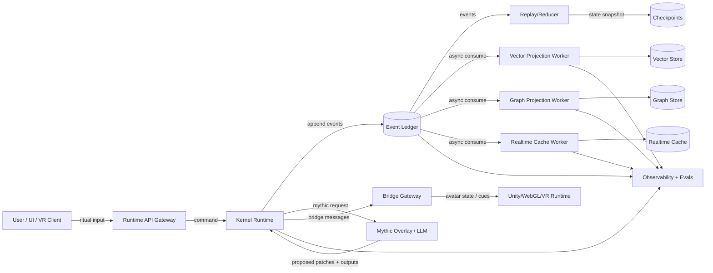
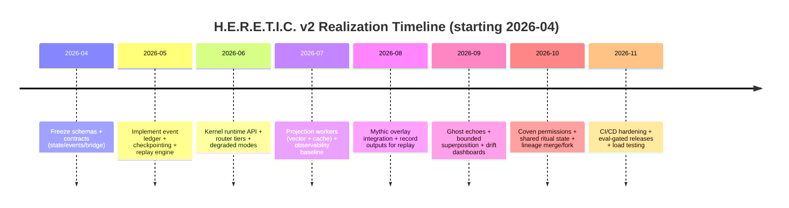

# Technical Realization Paths for the H.E.R.E.T.I.C. Thoughtform Engine

## Executive summary

The GitHub repository by entity["people","hrabanazviking","github user"] on entity["company","GitHub","code hosting platform"] is primarily a **specification and vision repo**, not an executable system. The most “implementable” material is the **H.E.R.E.T.I.C. v2 Implementation Pack**, which formalizes the project into an **event-sourced, replayable, versioned, testable, observable** agent runtime with explicit separation between a deterministic “kernel” and a high-variance “mythic overlay.” fileciteturn21file0L1-L1 fileciteturn23file0L1-L1 fileciteturn26file0L1-L1

From the pack’s core claims, the most robust technical “center” is:

1. A **canonical append-only event ledger** plus checkpoints (truth), with all other stores as projections (cache / indexes). fileciteturn23file0L1-L1  
2. A **routing policy** that enforces *hot/warm/cold latency tiers*, drift handling, and safe fallbacks. fileciteturn27file0L1-L1 fileciteturn30file0L1-L1  
3. **Bounded superposition/collapse** with “ghost echoes” as first-class artifacts for “alternate futures” and evolution. fileciteturn34file0L1-L1 fileciteturn35file0L1-L1 fileciteturn36file0L1-L1  
4. A stable **bridge contract** to a 3D runtime (Unity/WebGL/VR) that keeps “avatar state” expressive but non-canonical. fileciteturn38file0L1-L1 fileciteturn39file0L1-L1  

The repo, as-is, lacks: runnable code, dependency manifests, schemas in machine-readable format, build/run scripts, container manifests, CI/CD pipelines, security controls, and any concrete model-serving or data-layer setup. The right way to “realize” it is to implement the v2 pack as **contracts-first infrastructure**, then incrementally add model/memory/bridge capabilities behind those contracts.

This report gives multiple implementation pathways (local, hybrid, cloud-native, managed) with prerequisites, step-by-step plans, risks and mitigations, estimated resources, and rough cost ranges using current provider pricing where available. citeturn14search0turn17search0turn23search1turn23search2

## What the repo contains and what is missing

### What is concretely specified

The v2 Implementation Pack defines the key subsystems and their contracts:

- **Canonical truth via event ledger** (append-only) with strict per-stream ordering, immutable events, idempotent projections, and checkpoint acceleration. fileciteturn23file0L1-L1  
- **Canonical state structure** (“Thoughtform State Schema v2”) with explicit namespaces (identity, memory, emotion, ritual, graph, bridge, relationships/lineage, governance, ephemeral). fileciteturn24file0L1-L1  
- **Event taxonomy** with type families (lifecycle, ritual, graph execution, memory, ghost echoes, bridge, reflection/evolution, coven/lineage). fileciteturn25file0L1-L1  
- **Kernel vs mythic separation** to keep core execution replay-safe and audit-friendly while allowing richer, higher-variance behavior behind strict contracts. fileciteturn26file0L1-L1  
- **Router policy** that explicitly uses SLO tiering, drift score, chaos factor, bridge health, and permission scope to choose routes and fallbacks. fileciteturn27file0L1-L1  
- **Memory model as projections** (semantic, relationship, realtime) fed by canonical events rather than being peers. fileciteturn28file0L1-L1  
- **Observability model** (logs/metrics/traces/audit views), plus eval harness specifications and resurrection/continuity eval sets. fileciteturn29file0L1-L1 fileciteturn41file0L1-L1 fileciteturn43file0L1-L1  
- **Multi-user / “coven” mechanics** with roles, permission domains, shared ritual state, and merge/fork lineage semantics. fileciteturn44file0L1-L1 fileciteturn45file0L1-L1 fileciteturn46file0L1-L1  

### What is missing (gap analysis)

The repo does not provide (or does not reliably indicate) the following deliverables necessary to build/runs a system:

- **Executable runtime code** implementing the kernel graph, router, ledger writer, projection workers, and bridge server (core gap).
- **Machine-readable schemas** (e.g., JSON Schema / OpenAPI / Protobuf / Avro) and versioned migrations (only partially described in Markdown). fileciteturn32file0L1-L1  
- **Dependency management** (`pyproject.toml`, `requirements.lock`, container base images), CI scripts, and environment pinning.
- **Deployment artifacts**: Dockerfile(s), Compose/Kubernetes manifests, terraform, secrets handling, and upgrades.
- **Security model implementation**: authn/authz, tenancy isolation, sandboxing for tool execution, secret storage.
- **Model runtime strategy**: which model(s), which serving stack, which batching/streaming semantics, and how tool-calls are mediated.
- **Datastore selection and configuration**: the pack references Chroma/Neo4j/Redis as projections conceptually, but does not provide concrete configs or operational posture. fileciteturn23file0L1-L1 fileciteturn28file0L1-L1  

**Key inference:** the repo is already “architecture-first.” The fastest path to a real system is to implement the **ledger + replay + schemas + eval harness first**, and defer rich emergence/VR polish until the substrate is stable. fileciteturn21file0L1-L1 fileciteturn41file0L1-L1

## Reference architecture derived from the v2 pack

### Architectural principles to preserve

The implementation pack commits you to a few strong constraints that should drive every design choice:

- **Event ledger as canonical truth**; projections can be rebuilt and are never authoritative. fileciteturn23file0L1-L1  
- **Replay/resurrection as a first-class capability**, with checkpoints and migrations, and measurable continuity constraints. fileciteturn31file0L1-L1 fileciteturn32file0L1-L1  
- **Tiered latency budgets**: hot (bridge), warm (dialogue/turn), cold (reflection/compaction/evolution). fileciteturn30file0L1-L1  
- **Bounded superposition with ghost echoes**: every pruned branch is recorded or explicitly discarded; collapse is replayable. fileciteturn34file0L1-L1  
- **Kernel vs mythic boundary**: mythic layer proposes; kernel validates, commits, and emits events. fileciteturn26file0L1-L1  

These are basically “event-sourcing + deterministic reducer + optional stochastic proposal layer,” which aligns with classic event sourcing definitions. citeturn27search0

### Recommended logical modules

Below is a concrete module breakdown that matches the pack’s doc structure and keeps contracts explicit:

- **Ledger service**
  - Append-only store (primary) + checkpoint store
  - Read API by `(stream_id, sequence range)` / `correlation_id`
  - Idempotency + sequence allocation + immutability enforcement fileciteturn23file0L1-L1  
- **Kernel runtime**
  - State reducer (event → state transition)
  - Command validator (authz + schema + invariants)
  - Router (tiered policy) fileciteturn27file0L1-L1  
- **Projection workers**
  - Semantic vector projection
  - Relationship graph projection
  - Realtime cache projection fileciteturn28file0L1-L1  
- **Mythic overlay service**
  - LLM calls + style/persona shaping
  - Tool use under strict allowlists
  - Returns proposed patches + outputs (recorded for replay) fileciteturn26file0L1-L1  
- **Bridge gateway**
  - WebSocket/SSE/gRPC interface to 3D runtime
  - Versioned messages + monotonic seq per session
  - Degraded modes (text-only) fileciteturn38file0L1-L1  
- **Evals + observability**
  - Scenario runner + replay cases + scorecards
  - Traces/metrics/logs correlated by session and resurrection IDs fileciteturn29file0L1-L1 fileciteturn41file0L1-L1  

### Data flows as “command → events → projections → response”

The pack is explicit that projections are updated asynchronously and that command flow is:

> command → validate → emit event(s) → persist → ack → project asynchronously fileciteturn23file0L1-L1

Mermaid architecture sketch that matches this contract-first approach:

## Technical pathways to implement the system end to end

This section treats “pathway” as a full-stack choice (runtime + storage + model hosting + ops posture). All pathways still implement the same v2 contracts (ledger truth, replay, kernel/mythic boundary, SLO tiers).

### Comparison table for model hosting and inference serving

| Dimension | Local GPU (self-host) | Cloud GPU VM (self-host) | Cloud TPU (self-host) | Managed inference API |
|---|---|---|---|---|
| Typical fit | Personal/solo, privacy-first, offline-capable | Mid-scale, speed + control | High-throughput inference/training with TPU-native stacks | Fastest time-to-market, minimal ops |
| CapEx/OpEx | High upfront GPU cost; low marginal cost | Pure OpEx; expensive per hour | OpEx per chip-hour; strong scaling economics for some workloads | Pay per token/call; can be cheapest for intermittent use |
| Latency | Best if local + no network; VR streaming friendly | Good; network adds tail latency | Good in-region; requires TPU-optimized stack | Often good; depends on provider + routing |
| Complexity | Highest (drivers, quantization, batching, upgrades) | Medium-high (DevOps + GPU scheduling) | High (TPU toolchain, model compatibility) | Lowest |
| Privacy | Strong (data stays local) | Depends on VPC + controls | Depends on cloud controls | Depends on provider terms and data handling |
| Example cost anchors | AWS p5.48xlarge on-demand is often reported around $55/hr (third-party aggregations) citeturn16search0turn16search2turn17search1 | Same as prior; plus storage/network | TPU v5e listed at ~$1.20 per chip-hour on-demand (region-dependent) citeturn14search0 | OpenAI lists token pricing per 1M tokens for multiple models citeturn23search1; Bedrock has per-model pricing and model-copy billing for imports citeturn23search2 |
| Capacity options | Limited by your GPU VRAM | Scale up/out by adding GPU nodes | Scale by chips/pods; pricing per chip-hour is explicit citeturn14search0 | Provider-managed scaling; potential cold-starts for imported models citeturn23search2 |

### Pathway A: Local-first event-sourced monolith (single machine, Docker Compose)

**What it is:** one machine runs the kernel API, event ledger DB, projection workers, vector/graph/cache stores, and one local inference server—ideal for a single operator or small local coven.

**Prerequisites**

- Linux or Windows + WSL2; Docker with GPU support if using NVIDIA GPU. citeturn5search1turn5search5  
- GPUs accessible to containers (`--gpus` / NVIDIA runtime) if running local inference in containers. citeturn5search5  
- Hardware (rough):
  - CPU: 8–24 cores
  - RAM: 32–128 GB
  - GPU: 16–48 GB VRAM (more if you want larger models + VR rendering concurrently)
  - Fast SSD: 1–4 TB (event log + embeddings + artifact store)

**Implementation plan (step-by-step)**

1. **Freeze contracts**
   - Convert the Markdown schemas into JSON Schema/OpenAPI:
     - Thoughtform state schema v2 fileciteturn24file0L1-L1  
     - Canonical event envelope + event types fileciteturn23file0L1-L1 fileciteturn25file0L1-L1  
     - Bridge envelopes + avatar state schema fileciteturn38file0L1-L1 fileciteturn39file0L1-L1  
   - Generate typed models (e.g., with entity["organization","Pydantic","python validation library"] v2) and validate strict invariants at runtime. citeturn7search3  

2. **Implement ledger + checkpoints**
   - Start with entity["organization","PostgreSQL","relational database"] as canonical store (single node).
   - Table design: `events(stream_id, sequence, event_id, event_type, occurred_at, payload_jsonb, meta_jsonb, ...)` with unique `(stream_id, sequence)` + indexes on `event_type`, `occurred_at`, `correlation_id`. This matches the pack’s acceptance criteria and envelope. fileciteturn23file0L1-L1  
   - Checkpoints: `checkpoints(stream_id, last_sequence, state_version, snapshot_jsonb, created_at, ...)`. fileciteturn23file0L1-L1  

3. **Kernel runtime service**
   - Build a entity["organization","FastAPI","python web framework"] app with:
     - HTTP endpoints for commands (create thoughtform, start ritual session, submit fused input, request resurrection, etc.)
     - WebSocket endpoints for streaming bridge messages to the 3D client citeturn10search1turn10search4  
     - Background tasks only for lightweight post-response work (heavy tasks should be queued) citeturn9search0  
   - Router policy module implements the tier rules and fallback chain. fileciteturn27file0L1-L1  

4. **Mythic overlay module**
   - Start with a single “mythic generation” function that:
     - Accepts a strict `mythic_request` contract (identity summary, ritual context ref, allowed modes, output schema). fileciteturn26file0L1-L1  
     - Produces (a) user-visible output and (b) a JSON Patch-like proposed update to state.
   - Kernel validates update against schema + governance mode before emitting canonical events.

5. **Projection workers**
   - Semantic vector store: entity["company","Chroma","vector database"] local persistent client or server mode. citeturn13search4turn13search0  
   - Relationship graph: entity["company","Neo4j","graph database"] (or postpone graph store until later; start with Postgres tables as “graph projection v0”). If using Neo4j, APOC helps with dynamic graph manipulation. citeturn11search3turn11search9  
   - Realtime cache: entity["company","Redis","in-memory data store"] for pose/emotion mirrors; Pub/Sub can be used for intra-host signaling. citeturn11search10  
   - All workers read canonical events and maintain “last applied sequence.” fileciteturn28file0L1-L1  

6. **Replay + resurrection**
   - Implement the replay flow exactly as specified: load latest compatible checkpoint, apply migrations, read later events, reduce, recompute continuity hash, and rehydrate ephemeral caches. fileciteturn31file0L1-L1 fileciteturn32file0L1-L1  

7. **Observability + eval harness**
   - Adopt entity["organization","OpenTelemetry","observability framework"] for logs/traces correlation; implement correlation IDs per session/resurrection. fileciteturn29file0L1-L1 citeturn6search6  
   - Export metrics for SLO tiers and projection lag (Prometheus histograms are standard for latency distributions). citeturn6search4  
   - Use entity["company","Grafana","observability platform"] provisioning for dashboards-as-code. citeturn6search0turn6search1turn6search2  
   - Implement the eval harness structure and add the continuity + resurrection evals early. fileciteturn41file0L1-L1 fileciteturn42file0L1-L1 fileciteturn43file0L1-L1  

**Trade-offs**

- Strongest alignment with the v2 “replayable + inspectable” ethos, fastest for a solo builder because everything is in one place.
- Hard ceiling on concurrency, and local GPUs fight for resources if you also run a heavy 3D scene.

**Risks and mitigations**

- **Risk:** you accidentally let caches become “truth.”  
  **Mitigation:** delete a projection store in tests and require full rebuild from ledger + checkpoint as a CI gate. fileciteturn23file0L1-L1  
- **Risk:** superposition/ghost echoes cause uncontrolled compute growth.  
  **Mitigation:** enforce max depth by tier and add load-shedding rules exactly as guardrails specify. fileciteturn34file0L1-L1  
- **Risk:** bridge failures corrupt canon.  
  **Mitigation:** strict “bridge-is-never-canonical” boundary and degraded mode. fileciteturn38file0L1-L1 fileciteturn39file0L1-L1  

**Estimated resource needs and rough cost**

- **Hardware**: a modern workstation with 32–128 GB RAM and ≥16 GB VRAM GPU.  
- **Ongoing cost**: mainly electricity + local storage; cloud costs near-zero unless you still call external model APIs.

---

### Pathway B: Hybrid local experience + cloud model API (privacy-first memory, outsourced inference)

**What it is:** keep canonical ledger + memory projections local (or in your own VPC), but use a managed model API for mythic generation and/or speech-to-speech.

**Prerequisites**

- Same as Pathway A for the core substrate, but you can run with smaller/no GPU locally.
- API keys, key management, and a strong data policy.

**Implementation plan**

1. Implement Pathway A’s **ledger/replay/kernel/projections**.
2. Replace local mythic overlay inference with:
   - **External LLM call** for warm/cold tiers; keep hot tier local or minimal.
3. Record **model outputs and tool-call decisions as canonical events** so replay doesn’t need to “re-generate” (the pack’s kernel/mythic separation explicitly supports replay using recorded outputs). fileciteturn26file0L1-L1  
4. Add request-level controls:
   - Per-session correlation IDs, timeouts, retries, and fallback to text-only route. fileciteturn27file0L1-L1  
5. If you use entity["company","OpenAI","ai company"] as one option, pricing is per 1M tokens and varies by model; the official pricing page provides the current rates. citeturn23search1  
6. If you use entity["company","Amazon Web Services","cloud provider"] managed inference via entity["company","Amazon Bedrock","managed foundation model service"], note the billing model includes provider/model tiering and, for imported models, billing in time windows per active model copy. citeturn23search2  

**Trade-offs**

- Dramatically easier model ops and faster iteration.
- Harder privacy story (depends on provider policy and your own routing/redaction).

**Risks and mitigations**

- **Risk:** sensitive ritual/memory gets sent to an external endpoint.  
  **Mitigation:** add a redaction layer + “no-export” governance mode in kernel (`governance.policy_tags`, `sandbox_mode`) and enforce at router time. fileciteturn24file0L1-L1 fileciteturn27file0L1-L1  
- **Risk:** upstream latency spikes break warm-path budgets.  
  **Mitigation:** tiered fallback route, plus cached-input or batch modes where supported (OpenAI and others expose discounted batch/cached-input options). citeturn23search0turn23search1  

**Cost anchors**

- Token-priced APIs: see provider pricing (OpenAI example). citeturn23search1  
- Managed imports / model copies: see Bedrock pricing behavior. citeturn23search2  

---

### Pathway C: Cloud-native multi-tenant runtime (Kubernetes, horizontally scalable workers)

**What it is:** implement kernel as stateless API pods, ledger as durable DB, projections as scalable consumer groups, inference as GPU pool, and bridge gateways close to users.

**Prerequisites**

- Kubernetes cluster (self-managed or managed), CI/CD, infra-as-code.
- GPU node pool support and autoscaling strategy.

**Implementation plan**

1. **Ledger-as-a-service**
   - Canonical ledger in Postgres-compatible managed DB (or self-managed HA Postgres).
   - Use logical replication / CDC (Postgres supports logical replication) if you want downstream consumers beyond your own workers. citeturn11search4turn11search5  

2. **Kernel runtime**
   - Multiple replicas behind an ingress; kernel stays stateless except for reading/writing ledger.
   - Use OpenAPI-driven contract tests (OpenAPI v3.1 is a stable reference). citeturn7search0  

3. **Projection workers**
   - Separate deployments per projection (vector, graph, cache).
   - Scale projection workers horizontally; each maintains its last applied sequence.
   - For vector store, consider managed Chroma Cloud vs self-hosted Chroma; Chroma docs explicitly distinguish OSS vs cloud and note OSS telemetry changes (as of v1.5.4, no product telemetry). citeturn13search3turn13search6turn13search4  

4. **Inference serving**
   - GPU inference deployment with request batching and streaming outputs.
   - Hot/warm/cold tiers can map to different model sizes or even different providers. fileciteturn30file0L1-L1  

5. **Autoscaling**
   - Use Horizontal Pod Autoscaler to scale kernel and workers on CPU/memory/custom metrics. citeturn26search0  
   - For GPU inference, autoscale based on queue depth, p95 latency, and GPU utilization.

6. **Security and sandboxing**
   - Treat tool execution as “untrusted code.” Add a sandbox layer:
     - gVisor provides an “application kernel” and OCI runtime (`runsc`) that integrates with Docker/Kubernetes. citeturn25search0  
     - Firecracker microVMs provide stronger isolation than containers with small overhead in exchange for more complexity. citeturn28search0  
     - seccomp can restrict syscalls for defense-in-depth. citeturn28search8  
   - This directly supports the repo’s “sandbox_mode” and “wild_mode” tension: you can allow emergence *without* allowing host compromise. fileciteturn24file0L1-L1  

7. **Observability**
   - Full OpenTelemetry traces across kernel → inference → projection updates → bridge. fileciteturn29file0L1-L1 citeturn6search6  
   - Grafana dashboards + alerting as code. citeturn6search0turn6search1turn6search2  

**Trade-offs**

- Best scalability and clean operational boundaries.
- Most engineering-heavy: you’re effectively building a production-grade distributed system.

**Cost anchors**

- **Kubernetes overhead**: cluster cost + nodes + storage + observability.
- **Cloud GPUs**: costs vary; for a rough anchor, third-party AWS price aggregations often list p5.48xlarge on-demand around ~$55/hr (region-dependent). Use with caution and verify via your own provider calculator. citeturn16search0turn16search2turn17search1  
- **Cloud TPU**: Google publishes explicit per-chip-hour tables (e.g., v5e at $1.20/chip-hour on-demand in some regions). citeturn14search0  

---

### Pathway D: Managed-services-first (minimum ops, maximum speed)

**What it is:** kernel + contracts + ledger are still yours, but you outsource as much as possible: managed model API, managed vector DB, managed graph DB, managed monitoring.

**Prerequisites**

- Strong vendor governance and portability plan (especially for the event ledger and “saga stones”).

**Implementation plan**

1. Implement kernel + ledger + replay (still mandatory).
2. Use managed vector database (Chroma Cloud as one option) and managed graph DB offerings (or skip graph DB early).
3. Use managed inference:
   - Managed model API token pricing (OpenAI example). citeturn23search1  
   - Managed platform like Bedrock with model import options and tiering; note billing and cold-start behavior for imported models. citeturn23search2  
4. Build a rigorous “export” story:
   - “Saga stone” creation should include enough canonical data + selected projections to migrate away from vendors. fileciteturn31file0L1-L1  

**Trade-offs**

- Fastest to ship a usable companion.
- Risk of lock-in; careful with long-lived identity continuity (“continuity hash”) if providers/models change. fileciteturn24file0L1-L1  

**Risk mitigation**

- Always record final outputs/actions as canonical events and make replay independent of provider availability. fileciteturn26file0L1-L1  
- Keep schema migrations deterministic and versioned. fileciteturn32file0L1-L1  

## Model lifecycle: training, fine-tuning, inference serving, and multi-agent coordination

### Training and fine-tuning pipeline options

The repo does not define a training dataset or objective, but it does demand measurable continuity, grounding, drift containment, and resurrection fidelity. fileciteturn41file0L1-L1 fileciteturn43file0L1-L1

A pragmatic pipeline that aligns with those evals:

1. **Base model selection**
   - Choose a model family that supports tool-calling / structured output (important for patch proposals and bridge schemas).
2. **Persona + style alignment via parameter-efficient fine-tuning**
   - LoRA reduces trainable parameters and makes adaptation cheaper. citeturn24search5  
   - QLoRA extends this with 4-bit quantization + LoRA so large models can be fine-tuned on smaller GPUs (paper claims feasibility for 65B on a single 48GB GPU). citeturn24search1turn24search0  
3. **Behavior shaping via eval-linked iterations**
   - Every “major claim gets an eval” is already a design requirement. fileciteturn21file0L1-L1  
   - Implement evals first, then tune until continuity/grounding targets are met.

**Concrete code-level additions recommended**

- `evals/` scaffolding as specified, plus:
  - A replay test runner that replays a stored event stream and compares:
    - continuity hash stability
    - deterministic node outputs
    - resurrection fidelity scores fileciteturn41file0L1-L1 fileciteturn43file0L1-L1  
- A “prompt + tool-call trace recorder” that persists:
  - model input (possibly redacted)
  - model output
  - tool calls + tool results (hashed or stored)
  - schema validation results  
  This is essential to keep replay reliable when models change.

### Inference serving design (streaming + tiering)

Key requirements implied by the pack:

- Hot tier ≈ tens of ms for bridge responsiveness. fileciteturn30file0L1-L1  
- Warm tier ≈ sub-second-ish interactive turns. fileciteturn30file0L1-L1  
- Cold tier can be async and interruptible. fileciteturn30file0L1-L1  

A viable serving design:

- **Hot path**: no heavy LLM generation; only state mirroring, lightweight cue generation, and cached “next emote” logic.
- **Warm path**: main LLM generation + retrieval augmentation; must stream partial output to keep UX responsive.
- **Cold path**: reflection, compaction, evolution proposals, and replay audits.

Streaming mechanics:

- Use ASGI servers (entity["organization","Uvicorn","python asgi server"] docs cover WebSocket + HTTP lifecycle behavior) for stable connection and graceful shutdown. citeturn8search0turn8search1turn8search2  
- For HTTP streaming, Starlette’s `StreamingResponse` is a standard primitive. citeturn10search0  
- For VR/client updates, FastAPI WebSockets are the canonical bridge choice. citeturn10search1  

### Multi-agent coordination and “emergent behavior” mechanisms

The repo’s mechanism set is conceptually close to “agents with memory, reflection, and branching futures,” which maps to published agent research:

- ReAct interleaves reasoning and actions, which is directly relevant to a mythic overlay that must propose actions and tool calls in traceable steps. citeturn24search4turn24search9  
- Generative Agents shows emergent social dynamics when agents maintain memory, reflection, and planning—similar to your “coven” and lineage mechanics. citeturn24search7  

Concretely, H.E.R.E.T.I.C. v2 already describes *its* emergent substrate:

- **Superposition intents** at the graph layer and bounded collapse. fileciteturn24file0L1-L1 fileciteturn34file0L1-L1  
- **Ghost echoes** as persisted non-selected futures usable for evolution and alternate-future queries. fileciteturn35file0L1-L1 fileciteturn36file0L1-L1  
- **Drift score + chaos factor** as continuous control variables, logged and observable. fileciteturn24file0L1-L1 fileciteturn29file0L1-L1  

**Implementation recommendation (code-level)**

Implement “emergence” as a set of deterministic kernel hooks:

- A `BranchGenerator` interface: given current state + context, return candidate next nodes and candidate proposed outputs, with scores + provenance.
- A `CollapsePolicy` that:
  - enforces max depth by tier
  - emits `ghost_echo.created` for all pruned branches
  - records collapse score and measurement source fileciteturn34file0L1-L1 fileciteturn25file0L1-L1  
- An `EchoIndexer` projection consumer that supports the alternate-futures query API shape. fileciteturn36file0L1-L1  

This keeps emergence measurable and replay-safe.

## Operations: deployment, environments, security, observability, testing, scalability, and cost

### Build and deployment options

**Containers**

- Docker GPU support and `--gpus` access are documented; on Windows this is WSL2 GPU-PV in Docker Desktop. citeturn5search1  
- NVIDIA container toolkit explains `--gpus` and `NVIDIA_VISIBLE_DEVICES` semantics for GPU selection in containers. citeturn5search5  

**Kubernetes**

- Scale kernel/workers horizontally using HPA. citeturn26search0  
- Use custom metrics to scale on queue depth/latency, which is especially relevant to warm-tier turn generation.

### Security and sandboxing posture

This project’s “mythic overlay” plus tool-use implies you will run either user-influenced code paths or model-generated actions. Treat those as untrusted.

A strong layered strategy:

- **Sandbox for tool execution**
  - gVisor provides an application-kernel approach to reduce container escape risk and integrates with Docker/Kubernetes via `runsc`. citeturn25search0  
  - Firecracker microVMs offer stronger isolation than containers with a minimal device model and small memory overhead; also designed for multi-tenant workloads. citeturn28search0  
  - seccomp can restrict syscalls as another defense layer. citeturn28search8  

- **API authn/authz**
  - Use OAuth2 scopes (FastAPI supports this cleanly) to map coven roles/permissions to API scope checks. citeturn8search4turn8search5  
  - Enforce coven permissions before mutation; log all coven actions as events. fileciteturn44file0L1-L1  

- **Supply-chain security**
  - If adopting agent frameworks (e.g., LangGraph ecosystem), pin versions and monitor advisories; there have been recent reports of high-severity vulnerabilities in this ecosystem and downstream dependency webs. citeturn5news48  

### Persistence and data architecture

- **Canonical ledger**: Postgres (simple, robust) is explicitly suggested as early implementation. fileciteturn23file0L1-L1  
- **Projections**
  - Chroma supports persistent clients and differentiates OSS vs managed; OSS telemetry has changed (no product telemetry as of a referenced version). citeturn13search4turn13search3  
  - Redis Pub/Sub can support intra-system signaling and decoupling in a projection pipeline. citeturn11search10  
  - Neo4j + APOC can help with dynamic graph updates and subgraph extraction for lineage queries. citeturn11search3turn11search9  

- **Compaction**
  - Do not compact away identity, lineage boundaries, or banishment/resurrection markers. fileciteturn37file0L1-L1  

### Observability implementation

- Use OpenTelemetry signals (logs, traces, metrics) with correlation IDs per ritual session and resurrection run. fileciteturn29file0L1-L1 citeturn6search6  
- Prometheus histograms are standard for latency distribution; be careful choosing histograms vs summaries. citeturn6search4  
- Grafana provisioning and alerting allow GitOps-style reproducibility. citeturn6search0turn6search2  

### Testing, CI/CD, and replay-based regression

Minimum test layers aligned to the pack:

- **Schema tests**: every event and state snapshot validates against schema versions and invariants. fileciteturn24file0L1-L1  
- **Replay determinism tests**: rebuild state from events and ensure continuity hash and deterministic node outputs match. fileciteturn31file0L1-L1  
- **E2E bridge tests**: WebSocket protocol stability; FastAPI provides patterns for testing lifespan/startup. citeturn10search3  
- **Eval harness regression**: run baseline eval pack per release. fileciteturn41file0L1-L1  

### Scalability, latency, and cost notes

Two cost anchors that are unusually “clean” in public docs right now:

- **Google Cloud TPU** publishes per chip-hour on-demand and committed-use pricing (including v5e/v5p/Trillium). citeturn14search0turn14search2  
- **AWS EC2 Capacity Blocks for ML** publishes effective hourly rates for reserved windows for P5 (e.g., p5.48xlarge listed at $31.464 per instance-hour in several regions, with regional variation). citeturn17search0  

For on-demand GPU VM pricing on AWS/Azure, the most accessible numbers in this research pass are from third-party aggregators that claim to track provider price lists (verify with your own pricing calculators before committing). Example cited anchors: citeturn16search0turn16search1turn22search2

For managed token pricing, OpenAI’s API pricing is explicitly published per 1M tokens and changes by model/version. citeturn23search1turn23search3

## Prioritized roadmap and milestones

### Roadmap strategy

The v2 pack itself recommends an “application order” that aligns with classic event sourcing: contracts → ledger/replay → projections → boundary separation → eval/observability → lineage mechanics. fileciteturn21file0L1-L1

Below is a roadmap that maps that order to concrete milestones you can implement and ship.

### Milestones and deliverables

| Milestone | Core deliverable | “Done when…” | Biggest risk to watch |
|---|---|---|---|
| Contracts freeze | JSON Schemas / OpenAPI / typed models for state/events/bridge | Every command/event validates; schema versions tracked | Schema drift and “just add a field” impulses |
| Ledger + replay | Append-only ledger + checkpoints + migrations | You can delete projections and fully rebuild; replay to any sequence works | Non-idempotent reducers, sequence bugs |
| Kernel runtime v0 | Command processing + router + degraded modes | Hot/warm/cold tier mapping enforced and logged | Tier creep / latency confusion |
| Projections v0 | Vector + cache projections (graph optional) | Projection lag observable; lag doesn’t break canon | Projection becoming “truth” |
| Mythic overlay v0 | Model outputs recorded as events | Replay does not require regeneration | Model nondeterminism leaks into canonical state |
| Ghost echoes + superposition | Bounded branching + alternate futures queries | Every prune emits ghost echo and is inspectable | Branch explosion / cost runaway |
| Coven + lineage | Permissions + shared ritual sessions + merge/fork semantics | Merge/fork/restoration are distinguishable and auditable | Identity continuity corruption |
| Observability + eval gates | Baseline eval pack in CI | Releases blocked on regression | Metric overload without clarity |

### Mermaid timeline

### Primary sources and original papers referenced

- Event sourcing definition and motivations: entity["people","Martin Fowler","software engineer"] “Event Sourcing.” citeturn27search0  
- LoRA: “LoRA: Low-Rank Adaptation of Large Language Models.” citeturn24search5  
- QLoRA: “QLoRA: Efficient Finetuning of Quantized LLMs.” citeturn24search1turn24search0  
- ReAct: “ReAct: Synergizing Reasoning and Acting in Language Models.” citeturn24search9turn24search4  
- Generative Agents: “Generative Agents: Interactive Simulacra of Human Behavior.” citeturn24search7  
- Chroma docs (persistent client, OSS posture): citeturn13search4turn13search3turn13search0  
- OpenTelemetry logs spec: citeturn6search6  
- Prometheus histogram guidance: citeturn6search4  
- Grafana provisioning/alerting docs: citeturn6search0turn6search1turn6search2  
- gVisor sandboxing overview: citeturn25search0  
- Firecracker microVM overview: citeturn28search0  
- seccomp syscall sandboxing interface: citeturn28search8  
- Kubernetes HPA scaling concepts: citeturn26search0  
- Cloud TPU chip-hour pricing tables: citeturn14search0  
- AWS EC2 Capacity Blocks for ML pricing (P5): citeturn17search0  
- OpenAI API pricing (token-based): citeturn23search1turn23search3