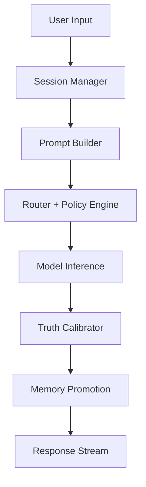

# Volume 1 — Executive System Architecture

## 1. Mission Envelope
The system target is an emotionally coherent, safety-constrained, memory-persistent companion intelligence that can reason over long-term identity state, multi-modal input, and mission-bound execution workflows.

## 2. Macro Architecture Layers
1. **Interaction Layer**: Chat, voice, event feed, ritual sessions.
2. **Cognitive Orchestration Layer**: Router, planner, tool policy guard, sub-agent runtime.
3. **Memory and World Model Layer**: Episodic memory, semantic memory, symbolic graph memory, user-model state.
4. **Model Layer**: Large model + small specialist models + embedding models + ranking models.
5. **Platform Layer**: APIs, streaming, observability, feature flags, identity and access.
6. **Safety Layer**: Policy engine, abuse controls, injection guards, trust calibration.

## 3. Core Services
### 3.1 `session-manager`
- Responsibility: Owns `session-manager` lifecycle and APIs.
- SLO target: p95 latency < 350 ms for metadata operations; specialized paths differ by workload.
- Data contracts: Versioned JSON schema with migration handlers.
- Failure mode: Degraded mode fallback + incident telemetry.

### 3.2 `prompt-builder`
- Responsibility: Owns `prompt-builder` lifecycle and APIs.
- SLO target: p95 latency < 350 ms for metadata operations; specialized paths differ by workload.
- Data contracts: Versioned JSON schema with migration handlers.
- Failure mode: Degraded mode fallback + incident telemetry.

### 3.3 `persona-compiler`
- Responsibility: Owns `persona-compiler` lifecycle and APIs.
- SLO target: p95 latency < 350 ms for metadata operations; specialized paths differ by workload.
- Data contracts: Versioned JSON schema with migration handlers.
- Failure mode: Degraded mode fallback + incident telemetry.

### 3.4 `memory-store`
- Responsibility: Owns `memory-store` lifecycle and APIs.
- SLO target: p95 latency < 350 ms for metadata operations; specialized paths differ by workload.
- Data contracts: Versioned JSON schema with migration handlers.
- Failure mode: Degraded mode fallback + incident telemetry.

### 3.5 `micro-rag-pipeline`
- Responsibility: Owns `micro-rag-pipeline` lifecycle and APIs.
- SLO target: p95 latency < 350 ms for metadata operations; specialized paths differ by workload.
- Data contracts: Versioned JSON schema with migration handlers.
- Failure mode: Degraded mode fallback + incident telemetry.

### 3.6 `truth-calibrator`
- Responsibility: Owns `truth-calibrator` lifecycle and APIs.
- SLO target: p95 latency < 350 ms for metadata operations; specialized paths differ by workload.
- Data contracts: Versioned JSON schema with migration handlers.
- Failure mode: Degraded mode fallback + incident telemetry.

### 3.7 `bond-graph-service`
- Responsibility: Owns `bond-graph-service` lifecycle and APIs.
- SLO target: p95 latency < 350 ms for metadata operations; specialized paths differ by workload.
- Data contracts: Versioned JSON schema with migration handlers.
- Failure mode: Degraded mode fallback + incident telemetry.

### 3.8 `policy-engine`
- Responsibility: Owns `policy-engine` lifecycle and APIs.
- SLO target: p95 latency < 350 ms for metadata operations; specialized paths differ by workload.
- Data contracts: Versioned JSON schema with migration handlers.
- Failure mode: Degraded mode fallback + incident telemetry.

### 3.9 `event-ledger`
- Responsibility: Owns `event-ledger` lifecycle and APIs.
- SLO target: p95 latency < 350 ms for metadata operations; specialized paths differ by workload.
- Data contracts: Versioned JSON schema with migration handlers.
- Failure mode: Degraded mode fallback + incident telemetry.

### 3.10 `eval-harness`
- Responsibility: Owns `eval-harness` lifecycle and APIs.
- SLO target: p95 latency < 350 ms for metadata operations; specialized paths differ by workload.
- Data contracts: Versioned JSON schema with migration handlers.
- Failure mode: Degraded mode fallback + incident telemetry.

## 4. Runtime Flow (End-to-End)

## 5. Non-Functional Requirements
- Availability: 99.9% for core interaction endpoints.
- Durability: zero data loss for committed memory events (RPO=0 using transactional event ledger).
- Recovery: RTO < 30 minutes for regional failover.
- Compliance: auditable event lineage, configurable retention controls.

## 6. Proposed Repository Targets
- `src/wyrdforge/services/`: production services and orchestration paths.
- `src/wyrdforge/models/`: strongly typed pydantic models and validation.
- `src/wyrdforge/security/`: policy and adversarial hardening modules.
- `docs/` or `proposed_system_report/`: high-signal architecture and operational references.

## 7. Architecture Decision Records (ADRs) Required
1. Event sourcing vs mutable state architecture.
2. Hybrid graph + vector memory strategy.
3. Inference routing and model portfolio policy.
4. Safety gating with calibration vs pure post-hoc filtering.